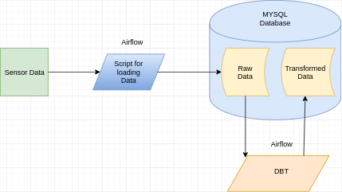

# Project: Build A Data Warehouse using MYSQL, Airflow and DBT

<h3 align="center"></h3>

This project builds a scalable **data warehouse** tech-stack that will help to provide an AI service to a client. The [Data](https://anson.ucdavis.edu/~clarkf/) used for this project is sensor data in csv format. In [Data (ucdavis.edu)](https://anson.ucdavis.edu/~clarkf/) you can find parquet data, and or sensor data in CSV. **ELT pipeline** that extracts data from the links in the website, stages them in MYSQL Database, and transforms data using DBT. This whole process is automated using Airflow. 

# Table of Contents
- [Project: Build A Data Warehouse using MYSQL, Airflow and DBT](#project-build-a-data-warehouse-using-mysql-airflow-and-dbt)
- [Table of Contents](#table-of-contents)
- [Project Structure](#project-structure)
- [ELT Pipeline](#elt-pipeline)
  - [load_data_airflow.py](#load_data_airflowpy)
  - [dbt_airflow.py](#dbt_airflowpy)
- [License](#license)

# Project Structure

```
airflow
|___dags
  |____create_station_Summary.sql    # database/table creation using MYSQL
  |____insert_station_summary.sql    # sql file for loading data
  |____load_data_airflow.py          # loads data 
  |____dbt_airflow.py                # transforms data using dbt 
DBT
|___models
  |____merged_station.sql            # sql file for transforming tables
```


# ELT Pipeline
## load_data_airflow.py
ELT pipeline builder

1. `create_tables`
	* create tables using MYSQL and automates using airflow
2. `load_tables`
	* Load raw data from CSV Dataframe to  staging tables and automates using airflow

## dbt_airflow.py
Transforms table using sql files and automates using airflow

# License
[MIT](https://github.com/nebasam/Data-Warehouse-using-MYSQL)

